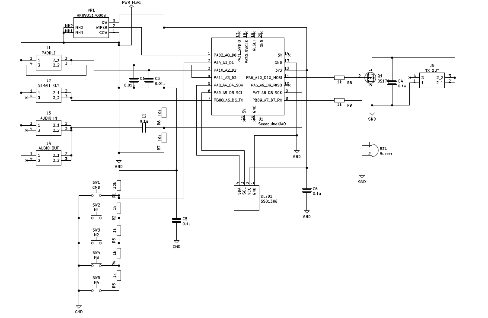
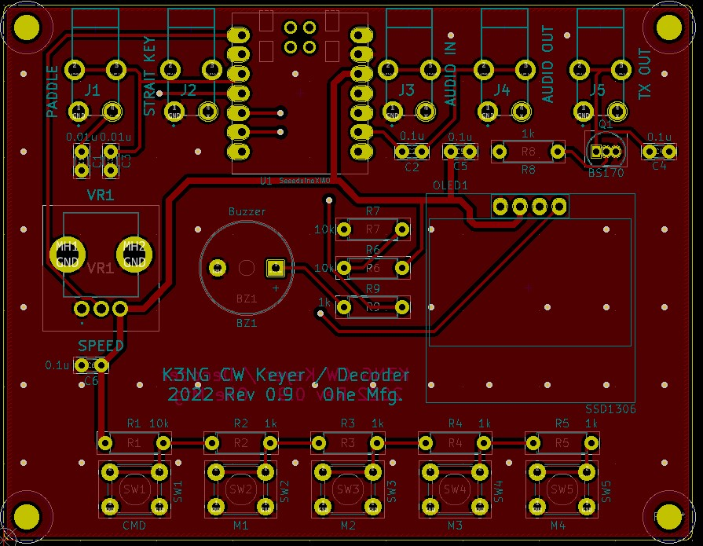

# K3NG CW keyerの作成
## はじめに
K3NG CW keyerはArduinoをベースとした多機能キーヤです。
すでにたくさんの方が作成され、また、作成が公開されていますが、今回作りやすさに重点を置き新たに作成しました。

## 主な特徴
- CPUボードは、小型のSeeed社のXiao（SAM D21 Cortex M0+ MCU 48MHz)を使用してコンパクト化する
- ディスプレィは0.96inchのOLEDとする
- 4つのメモリボタンとコマンドボタンをサポート
- パドルとストレートキーが同時に接続可能
- CW DECODERを有効化

## ハードウェア
### 回路図
CPUにSeeedのXiaoを使用している以外は特別な回路はありません。
パドル、ストレートキー、受信入力、受信出力、送信出力はそれぞれ3mmのPhone Jackを接続してあります。

### PCB
PCBは作りやすさを考慮して9cm☓7cmのサイズとし、スルーホール部品を使用しています。

